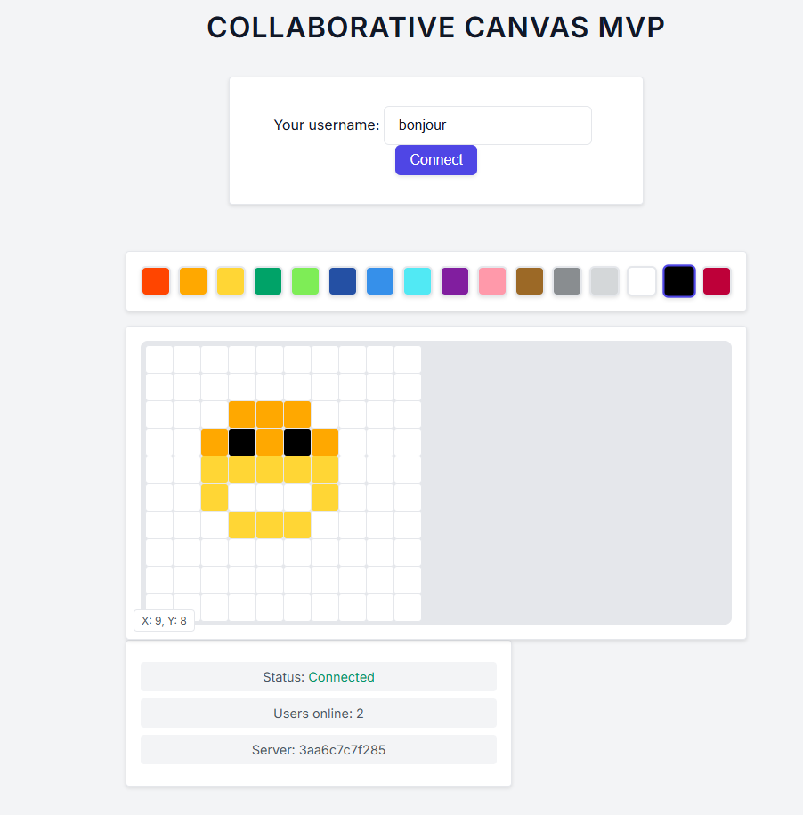
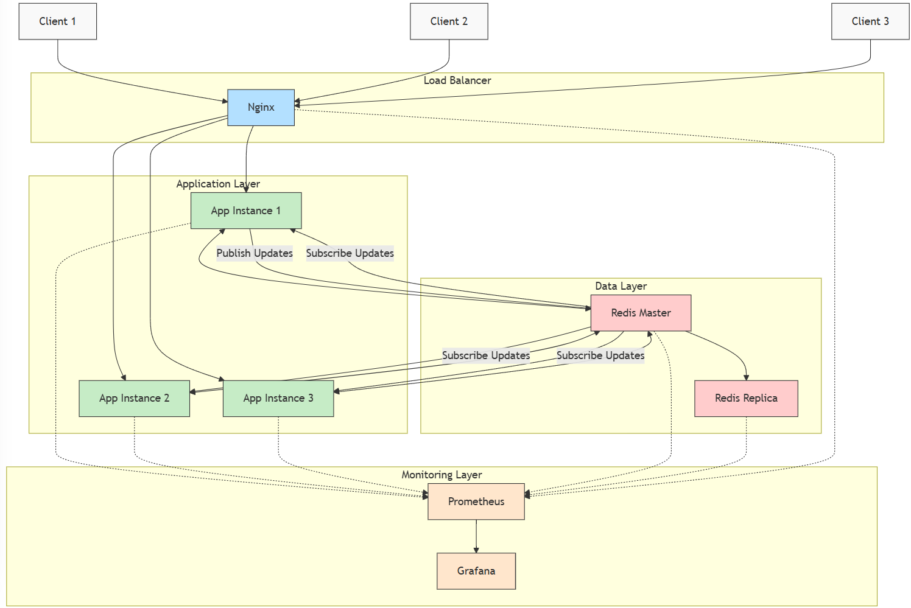
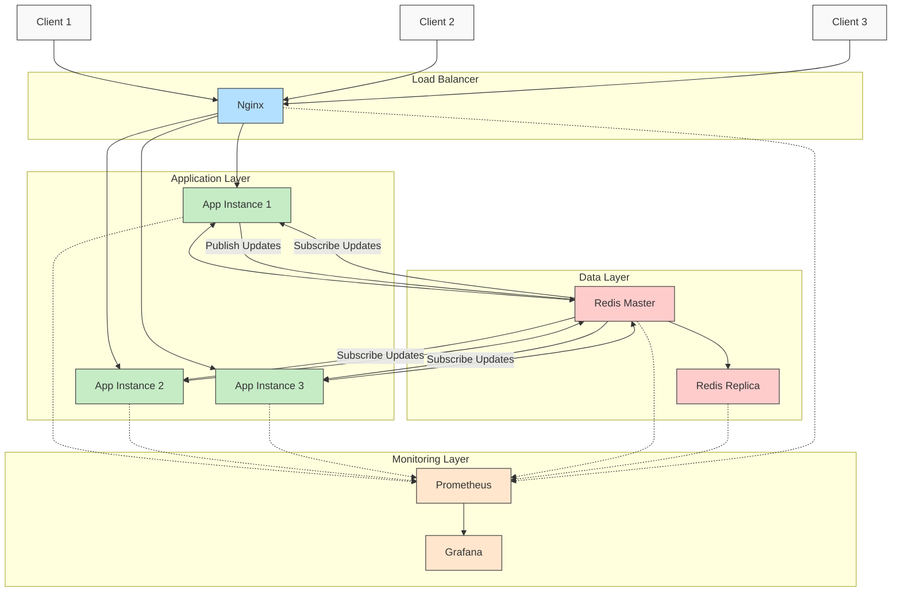

# 🎨 Canvas - Distributed Web Application

A scalable, distributed web application designed for collaborative real-time interactions, leveraging Redis for caching and Pub/Sub mechanisms.



## 📑 Table of Contents

- [Architecture Overview](#architecture-overview)
- [Application Workflows](#application-workflows)
- [Getting Started](#getting-started)
- [Accessing the Services](#accessing-the-services)
- [What's Missing for Production?](#whats-missing-for-production)

## 🏗️ Architecture Overview

The application is built around a distributed architecture using Docker Compose, structured as follows:



<details>
<summary>📊 Voir le code source du diagramme (Mermaid)</summary>



</details>

### 🔄 Key Components

- **Redis Master-Replica**:
  - Redis Master handles all write operations and maintains the primary data store.
  - Redis Replica provides redundancy and read scalability.

- **Pub/Sub Mechanism**:
  - Redis Pub/Sub is used for real-time communication between application instances.
  - Ensures instant synchronization of canvas state across all connected clients.

- **Web Application Instances**:
  - Multiple identical instances (app1, app2, app3) handle user requests.
  - Stateless design allows seamless scaling and load distribution.

- **Load Balancing with Nginx**:
  - Nginx distributes incoming traffic evenly across application instances.
  - Provides a single entry point for users, enhancing performance and reliability.

- **Monitoring Stack**:
  - Prometheus collects real-time metrics from all services.
  - Grafana visualizes these metrics, providing insights into system health and performance.

## 🔄 Application Workflows

Here's how the application handles various interactions:

### 👤 User Connection

1. User connects to the application through Nginx load balancer
2. Nginx routes the request to one of the application instances (app1, app2, or app3)
3. The application instance establishes a WebSocket connection with the client
4. The instance subscribes to Redis Pub/Sub channels for real-time updates
5. Current canvas state is retrieved from Redis and sent to the new client

### 🖌️ Placing a Tile

1. User places a tile on their canvas
2. Client sends tile data (position, color) to their connected application instance
3. Application instance validates the request
4. If valid, the instance:
   - Updates the canvas state in Redis Master
   - Publishes the update to a Redis Pub/Sub channel
5. All application instances receive the published update
6. Each instance forwards the update to its connected clients
7. All users see the new tile appear in real-time

### 📡 Broadcasting Updates

1. Any change to the canvas triggers a message to Redis Pub/Sub
2. Redis distributes this message to all subscribed application instances
3. Each instance processes the update and forwards it to connected clients
4. This ensures all users see the same canvas state regardless of which instance they're connected to

### 🔌 Detecting Disconnections

1. WebSocket connections maintain heartbeats between clients and servers
2. When a client disconnects:
   - The application instance detects the broken connection
   - User's session data is updated in Redis
   - Other users may be notified of the disconnection (if relevant)
3. If an application instance fails:
   - Nginx detects the failure through health checks
   - New connections are routed only to healthy instances
   - Disconnected users can reconnect and will be routed to available instances

### 💾 Session Persistence

1. User session data is stored in Redis, not in application memory
2. This allows users to reconnect to any application instance
3. If a user's connection moves from one instance to another (via load balancing):
   - Their session data remains accessible
   - Their experience continues seamlessly

## 🚀 Getting Started

```bash
# Clone the repository
git clone https://github.com/yourusername/canvas.git
cd canvas

# Create a .env.development file with necessary environment variables
# Example:
# APP_PORT=8080
# REDIS_HOST=redis-master
# REDIS_PORT=6379

# Build and start the services
docker-compose up --build -d
```

## 🌐 Accessing the Services

| Service | URL | Credentials |
|---------|-----|-------------|
| Application | http://localhost | - |
| Prometheus | http://localhost:9090 | - |
| Grafana | http://localhost:3000 | username: admin<br>password: admin |

## 🔮 What's Missing for Production?

To transform this MVP into a robust, scalable, and resilient production-ready application, consider the following enhancements:

### 📈 Scalability
- Implement auto-scaling mechanisms based on real-time load.
- Migrate orchestration to Kubernetes or Docker Swarm for advanced scalability.

### 🛡️ Resilience & High Availability
- Deploy Redis Sentinel or Redis Cluster for fault tolerance and high availability.
- Implement comprehensive health checks and automatic failover strategies.

### 🔒 Security
- Secure communication channels with HTTPS (Let's Encrypt).
- Strengthen Redis security with authentication and encryption.
- Regularly update and manage credentials securely.

### 📊 Advanced Monitoring & Alerting
- Configure detailed Grafana dashboards tailored to operational needs.
- Set up proactive alerting systems integrated with notification services (Slack, email).

### 🔄 Continuous Integration & Deployment (CI/CD)
- Establish automated testing and deployment pipelines.
- Ensure rapid, reliable, and repeatable deployments.

### 💾 Data Management & Backup
- Implement regular backups and a clear data restoration strategy.
- Ensure data integrity and availability in case of failures.
